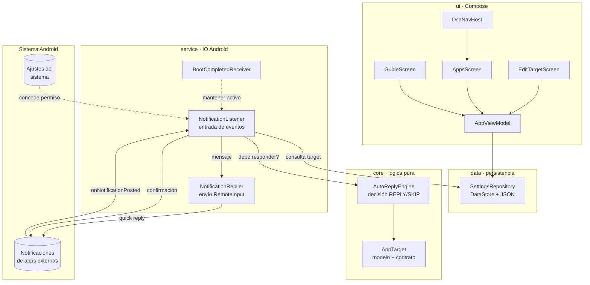
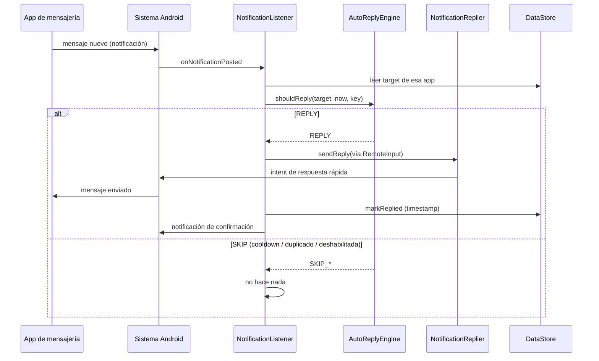

# DIAGRAM — DCA

## Arquitectura (VSA)

```mermaid
flowchart TB
    subgraph UI["ui · Compose"]
        GS[GuideScreen]
        AS[AppsScreen]
        ES[EditTargetScreen]
        VM[AppViewModel]
        NAV[DcaNavHost]
    end

    subgraph CORE["core · lógica pura"]
        ENG[AutoReplyEngine<br/>decisión REPLY/SKIP]
        AT[AppTarget<br/>modelo + contrato]
    end

    subgraph DATA["data · persistencia"]
        REPO[SettingsRepository<br/>DataStore + JSON]
    end

    subgraph SERVICE["service · IO Android"]
        LISTENER[NotificationListener<br/>entrada de eventos]
        REPLIER[NotificationReplier<br/>envío RemoteInput]
        BOOT[BootCompletedReceiver]
    end

    subgraph SYS["Sistema Android"]
        OS[(Notificaciones<br/>de apps externas)]
        SET[(Ajustes del<br/>sistema)]
    end

    OS -->|onNotificationPosted| LISTENER
    LISTENER -->|consulta target| REPO
    LISTENER -->|debe responder?| ENG
    ENG --> AT
    LISTENER -->|mensaje| REPLIER
    REPLIER -->|quick reply| OS
    LISTENER -->|confirmación| OS
    BOOT -.->|mantener activo| LISTENER
    SET -.->|concede permiso| LISTENER

    AS --> VM
    ES --> VM
    GS --> VM
    VM --> REPO
    NAV --> AS
```

## Flujo de auto-respuesta

```mermaid
sequenceDiagram
    participant App as App de mensajería
    participant OS as Sistema Android
    participant L as NotificationListener
    participant E as AutoReplyEngine
    participant R as NotificationReplier
    participant D as DataStore

    App->>OS: mensaje nuevo (notificación)
    OS->>L: onNotificationPosted
    L->>D: leer target de esa app
    L->>E: shouldReply(target, now, key)
    alt REPLY
        E-->>L: REPLY
        L->>R: sendReply(vía RemoteInput)
        R->>OS: intent de respuesta rápida
        OS->>App: mensaje enviado
        L->>D: markReplied (timestamp)
        L->>OS: notificación de confirmación
    else SKIP (cooldown / duplicado / deshabilitada)
        E-->>L: SKIP_*
        L->>L: no hace nada
    end
```